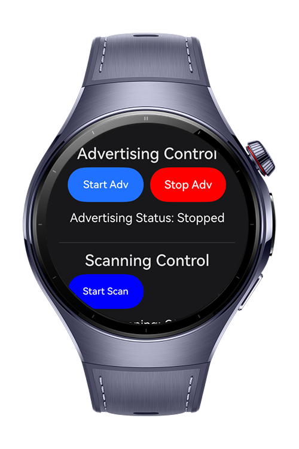
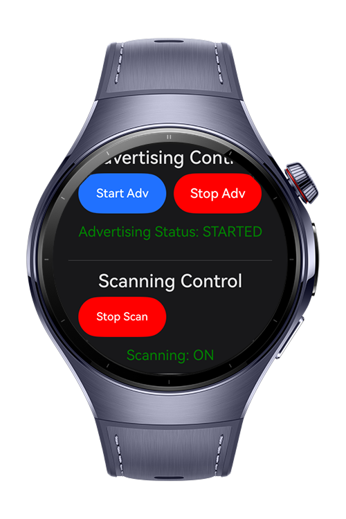
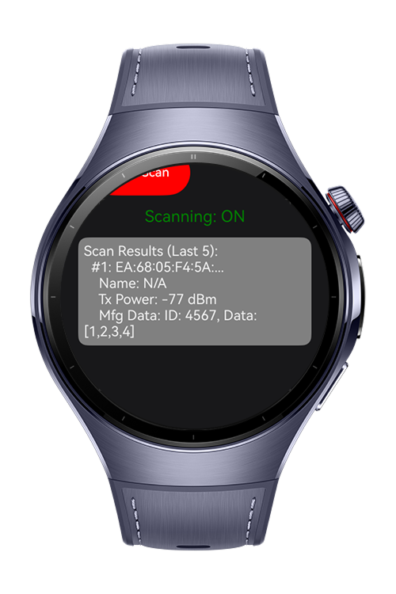

> **Note:** To access all shared projects, get information about environment setup, and view other guides, please visit [Explore-In-HMOS-Wearable Index](https://github.com/Explore-In-HMOS-Wearable/hmos-index).

# Safe Zone

The BleScanAdvertise project serves as a foundational Codelab demonstration for implementing Bluetooth Low Energy (BLE) functionality on HarmonyOS wearables.

This simple application showcases the dual capabilities of a BLE device: acting as both a Peripheral (Advertiser) and a Central (Scanner).
<p align="left">
    
    
    
</p>


# Use Cases
- Wearable advertises location ID.
- Scanners scan and track.
- Finder uses RSSI for guidance.

# Technology Stack
**Languages**: ArkTS, ArkUI  
**Frameworks**: HarmonyOS SDK 5.1.0  
**Tools**: DevEco Studio 5.1.0 Beta1
**Libraries/Kits**:
- @kit.ArkUI
- @kit.AbilityKit
- @kit.ConnectivityKit
- @kit.BasicServicesKit


# Directory Structure
```
├───main
│   │   module.json5
│   │
│   ├───ets
│   │   ├───entryability
│   │   │       EntryAbility.ets
│   │   │
│   │   ├───entrybackupability
│   │   │       EntryBackupAbility.ets
│   │   │
│   │   ├───pages
│   │   │       Index.ets
│   │   │       SplashScreen.ets
│   │   │
│   │   └───utils
│   │           BleAdvertising.ets
│   │           BleScanning.ets
│   │           RequestPermission.ets
│   │
│   └───resources
│       ├───base
│       │   ├───element
│       │   │       color.json
│       │   │       float.json
│       │   │       string.json
│       │   │
│       │   └───profile
│       │           backup_config.json
│       │           main_pages.json
│       │
│       ├───dark
│       │   └───element
│       │           color.json
│       │
│       └───rawfile

```


# Constraints and Restrictions
- The application requires the following user permissions to function properly:

  - ohos.permission.ACCESS_BLUETOOTH – for accessing precise location data.

- Without the necessary permissions, certain features may not operate correctly.

## Supported Device
- Huawei Watch 5

# License

**BleScanAdvertise** is distributed under the terms of the **MIT License**.  
See the [LICENSE](LICENSE) file for more information.  
